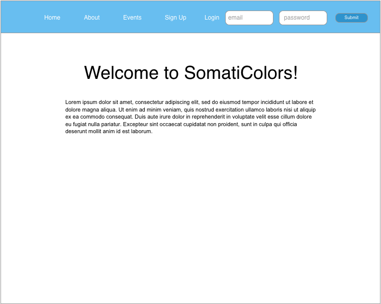
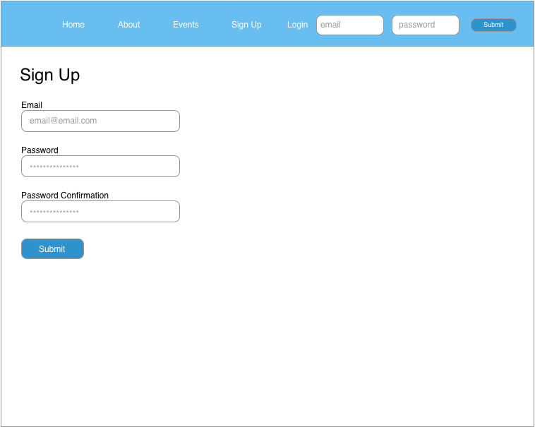

# SomatiColors 

SomatiColors enables users with Somatoform symptomatology to track events and situations in which they experience pain/fatigue. With the ability to visualize, filter, and sort through events plotted on their personalized timelines, users are better able to find the connections between their emotions and physical symptoms. 

> "Somatoform disorders are mental illnesses that cause bodily symptoms, including pain. The symptoms can't be traced back to any physical cause. And they are not the result of substance abuse or another mental illness. People with somatoform disorders are not faking their symptoms." - WebMD

If you fork this repo, you must run `npm install`, `mongod`, `mongo`, and `gulp` in order for this app to function properly.

[ Visit SomatiColors on Heroku ](http://somaticolors.herokuapp.com/)

-

### Technologies Used

* Node.js
* Express
* MongoDB + Mongoose
* AngularJS
* Nodemailer
* Gulp
* Bootstrap + Angular UI + Custom CSS
* Adobe Creative Cloud (Photoshop & Illustrator)
* OmniGraffle 
-

#### Screenshots


-

#### User Stories

| (Role) As a .. | (Goal) I want to.. |
|----------------|--------------------|
| User | log into my account |
| User | create an account |
| User | update my account settings |
| User | delete my account and timeline events |
| User | add my mental health psychian's email address so I can email events straight to their inbox |
| User | customize my emotional color pallete |
| User | create/edit/delete an event | Track emotions/bodily sensations |
| User | visualize event/situation emotions by creating a color stripe to the left of each timeline entry |
| User | visualize event/situation bodily sensations by marking an image of a body based on checkbox values |
| User | download the mobile app in order to read through my timeline during therapy |
| Visitor | learn more about SomatiColors on the about page |

-

#### ERD


##### User Model
``` username, password, first_name, last_name, email, mental_health_physician, physician_email```

##### Event Model
``` title, date, location, people_involved, situation, triggers, bodily_sensations, emotion, automatic_thoughts, rational_response, behaviors, consequences, challenged_beliefs, lesson, old_perspective, new_perspective, coping_strategies, user_id ```

-

#### Wireframes






